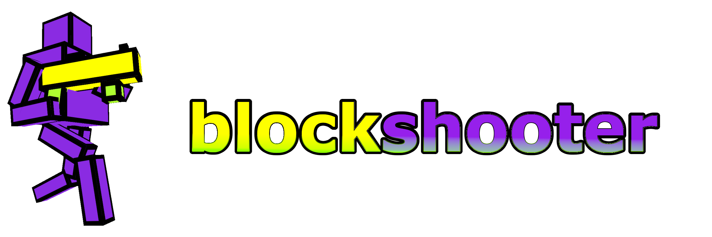

# 

A crazy browser based **multiplayer FPS** which **uses only CSS for rendering** and is **fully distributed (no server needed).**

## Live demo

Click here to play [blockshooter.](https://kenyerman.github.io/blockshooter)

## System requirements

Since CSS transformations are not really well suited to be used as a 3d rendering engine (and i didn't really bothered to optimize) unfortunatelly hardware requirements a bit high.

### Browser tests on a Macbook Air 2024 with Apple Silicon M3

- Safari ✅ (mostly 60 FPS, wich sometime drops to ~40)
- Chrome ⚠️ (screen flickering, ~50 FPS with heavy drops)
- Firefox ⛔️ (not supported)

## Objectives

- Shoot everyone
- Destroy everything
- Gather powerups
- Gain points
- Cause total havoc

## Features

This section covers most features of the game.

### Movement

- 6 degrees of freedom
- gravity
- jetpack
- ducking
- inbuilt bunny-hop

### Weapon mechanics

- togglable aim down sights
- dynamic spread and recoil based on player movement
- dynamic fully 3d viewmodel
- ammo
- semi animated playermodels
- hitboxes with different rewards

### Multiplayer

- up to 10 players
- players can set their names
- fully distributed (no server needed)
  - can be cheated easily, clients are not validating eachother

### Environment

- walls are fully destroyable
- walls can be built by players
- map size is 25 x 25 x 25 units
- _2fort_ like map (but a very cheap one)

### Resource management

- health
  - health points
  - armor
  - no falldamage
- automatic ammo regeneration
- bricks for building walls
- jetpack fuel

### Reward system

- scoreboard
- instant score gain display
- deathmessages

### Powerups

- fully 3d animated models
- disappears after some time if not taken
- activated powerups are displayed on HUD
- effects
  - max health and invulnerable for 15 sec
  - max ammo and free ammo for 15 sec
  - max jetpack fuel
  - add bricks (for building walls)

### Sounds

- players can hear each other's sound emissions by their positions
  - dynamic 3d sound implemented using [Howler.js](https://github.com/goldfire/howler.js)
- most player actions have their sounds
  - walking
  - taking powerups
  - shooting
  - shooting empty mag
  - shells falling
  - taking damage
  - damaging walls
  - building
  - using jetpack

### Chat

- players can chat with eachother
- no moderation
- messages can be seen by everyone (no DMs, no team message)

## Technical details

### Rendering

The building blocks of the game are quad faces which can be easily constructed from html `block` elements.
These faces are implemented under the `.face` css selector. They create rectangular quad faces on one of 3 planes (`x`, `y`, `z`).
After that they are getting wrapped and moved to their place according to their world position.
The faces are held together under `#scene` which is rotated and moved to make an impression of a camera moving through space.

Despite playermodels being more complex, the same wrapping technique can be used on them to move them onto their correct position. The main difference is that there are multiple non-rectangular faces wrapped together.

### Movement physics

The player's position and movement are managed by javascript. It is fairly easy to do collision detection this way (since we also know the position of the faces). The implementation is mostly done by using 3 vectors (position vector, velocity vector, euler vector) as state, and updating the position by the velocity and panning on each tick.

### Multiplayer

Multiplayer works via WebRTC implemented by using [peer.js](https://github.com/peers/peerjs) The process is distributed, clients are using a self generated unique string to identify themselves amongst other clients and the broker server.

Peer discovery is very simple, since `peer.js` uses string ids to identify clients, each client tries to get an id in the form of `css3dv2-X` where X gets incremented from 0 to 9 if the id is already in use. After a client successfully obtains an id, it tries to make connections to other clients by iterating through the same ids.

When a new client creates a new connection, the old client send the state of the current game (scoreboard, map, ...) which the new client copies. This means that the game state resets only if every client disconnects.

Most client messages are broadcasted amongst the clients. Broadcasting is done on clientside by iterating through all of the acquired connections.
Clients suppose that the incoming broadcasted messages are valid in the sense of the game. For example if `Client A` gets message from `Client B` that `A is shot by B`, `A` will lower it's health points without validating if `B` could really done the shot.
This gives a very simple implementation of managing shared state, however it's weak against bad actors.

### Dependencies

- [peer.js](https://github.com/peers/peerjs)
- [Howler.js](https://github.com/goldfire/howler.js)

## Motivation

I wanted to see how far can 3d css transformations go as a small research project. First I planned this as a weekend project, however as I came up with new and new ideas it took 8 weekends to complete.
